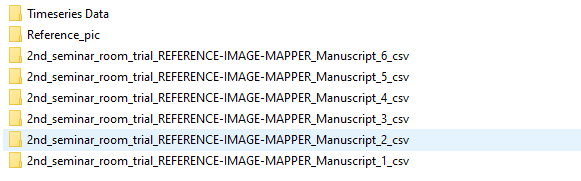
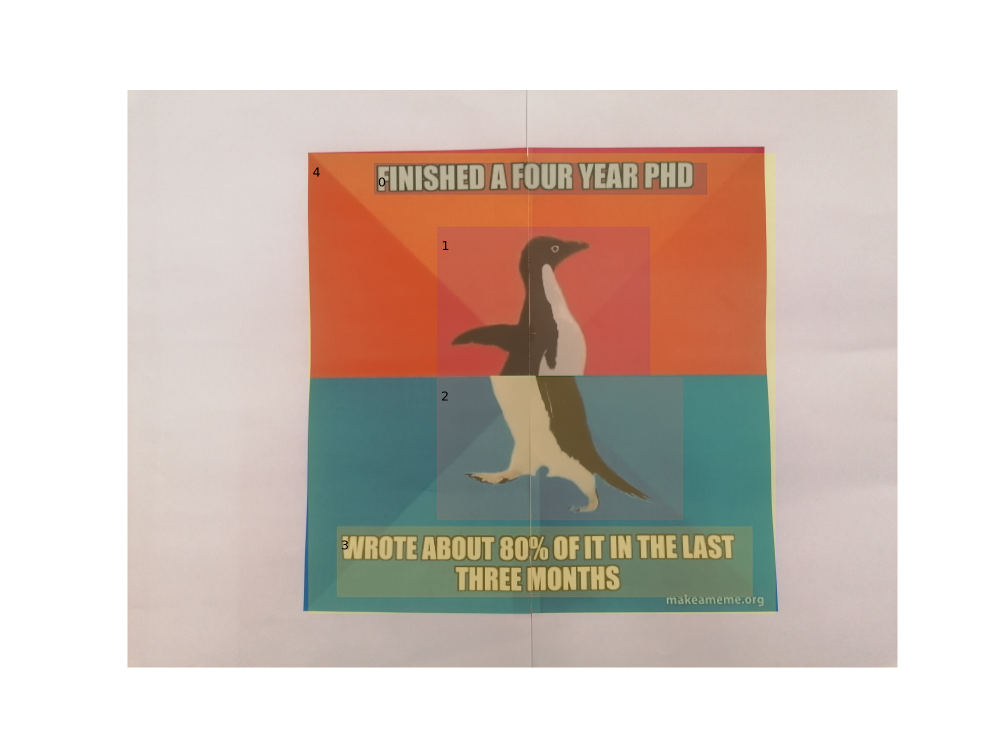
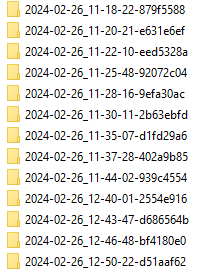
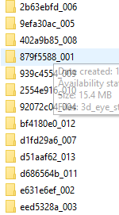

# Data file
In order to provide some data for you to test the scripts out, we have uploaded the data we collected with some funny memes. 
Raw timeseries data, which contains the pupil diameter data, as well as the fixation and gaze data processed with enrichment in [Pupil Cloud][1] have been downloaded. 
Please click on the [file](./Original_data_of_funny_pic.zip), and then click "View raw" to download it. 

# Aims and the built-up of scripts

## A little background information and the set-up of working space

In our project, we are very interested in the fixations in different parts of a manuscript and the saccades between each parts. We have various kinds of manuscripts: 
+  pictures
+  pictures with description
+  texts with illustration
+  texts with paratexts

AOIs of each manuscript need to be defined. However, AOIs are easier to capture in some manuscripts than the others and sometimes there are multiple sets of AOIs that we are interested in for one single manuscript. 

In this case, manuscripts (also as reference pictures for enrichment in [Pupil Cloud][1]) are saved in different folders with folder named "Reference_pic": 

[1]: https://pupil-labs.com/products/cloud

Folder "Complex_aoi" contains the manuscirpts that have multiple sets of AOIs or/and overlapped selection of AOIs (which will be explained with more details in the .py file).
Folder "Single_aoi" contains the manuscripts that have only one set of AOIs and they are not overlapped (I wish all reference pictures went to this folder but not the other......). 

Before you run the scripts, please make sure that the scripts are downloaded and saved in the same folder with the other folders including the raw timeseries data, the data from enrichment and reference pictures (as shown below):

Taking the first manuscript as an example, the original folder name, which is the same as the zip file from the successful enrichment process, is a combination of your project name, your choice of mapper for enrichment, the enrichment name (I named it with the same name of the reference picture of first manuscript, which is Manuscript_1.) and 'csv' linked with underscores.
I personally prefer a shorter folder name which still reminds me what this folder is about, so I changed the folder names into this:

However, this process is completely optional. You don't have to change your folder name as there are also codes prepared to the original long folder names. 

Now let's move on to the scripts.

## [Step0_0_AOI_extraction.py](./Step0_0_AOI_extraction.py)

As the first step of the data proprecessing, I named it Step 0. Another 0 behind it means that it is the first step within the first step (there are only two substeps anyway......).

Please click the .py file above for more detailed explanation of this script. 

## [Step0_1_Draw_save_AOIs.py](Step0_1_Draw_save_AOIs.py)

Here it comes the second step within the first step: visualing the AOIs and saving the visualisation.

Please click the .py file above for more detailed explanation of this script. 

## [Step0_extract_draw_save_AOIs.py](Step0_extract_draw_save_AOIs.py)

As you probably have discovered, these two steps within the first step of data proprecessing can be combined into one bigger step. 

Please click the .py file above for more detailed explanation of this script. 

## [Step1_Label_fixation_with_AOI_and_participants.py](Step1_Label_fixation_with_AOI_and_participants.py)

After defining the AOIs in each reference picture, the next step is to label the valid fixation data with the information of AOIs. 

The fixation data we use here are the ones from enrichment process. Thus, each "fixations.csv" file contains all participants' valid fixation data of one reference picture. Therefore, we will also label the data with the information of participants just in case. 

Please click the .py file above for more detailed explanation of this script. 

## [Addition_Step1_overlapped_aoi.py](Addition_Step1_overlapped_aoi.py)

With the applied approach for AOI selection, the AOIs can only be highlighted into rectangular areas. For example, as shown in the picture below: 

if we are also interested in the blank area (outside of AOIs from 0 to 3), we need to either 1) break down the blank area into several rectangles and select each one manuall; or 2) select the whole picture (as what has been done) and do the selection of the blank area during the data preprocessing. 

If you choose to go for the second choice, please click the .py file above for more detailed explanation of this script. 

## [Step2_Label_gaze_with_participant.py](Step2_Label_gaze_with_participant.py)

The gaze data from enrichment process have already been labelled with fixation numbers. However, as each "gaze.csv" file contains all participants' valid fixation data of one reference picture, we will also label the data with the information of participants just in case.

Please click the .py file above for more detailed explanation of this script. 

## [Change_foldername_timeseries.py](Change_foldername_timeseries.py)

The pupil diameter data are saved inside "Timeseries Data" folder as raw data that can be downloaded from [Pupil Cloud][1]. The structure of the data is slightly different from the data from enrichment process as each "3d_eye_states.csv" file within the recording folder contains only one participant's pupil diameter data from the entile recording (with all reference pictures that the participant has read during the experiment). 

The original folder names are very long as shown below:

 

which is a combination of realworld time of the recording and the first part of its recording id.

Although each recording has its unique id and the links between recording id and wearer can be found in the "sections.csv" fill, it will be much better and straigtforward if each folder name contains the wearer information as shown below:

 

Please click the .py file above for more detailed explanation of this script. 

## [Step3_Label_pupil_diameter_with_aoi_section.py](Step3_Label_pupil_diameter_with_aoi_section.py)

Pupil diameter data inside "3d_eye_states.csv" file are raw data from the entile recording. The differentiation between different manuscripts (reference pictures) and AOIs of each picture needs to be done. The approach adopted here is to find the start and end timestamps of each picture and AOI, and then label each row of the data accordingly in terms of the time. 

Please click the .py file above for more detailed explanation of this script. 

